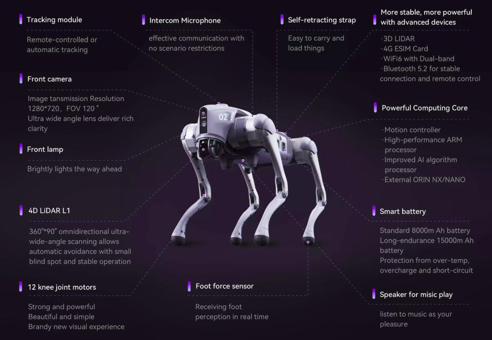

# mrdoanh_projects
Mr. Doanh Project

# UNITREE GO2 EDU

[](https://docs.ros.org/en/humble/) 
[](LICENSE) 
[](#)

## 1️⃣ Introduction
This is a ROS2 Humble workspace developed for the **Unitree Go2 EDU robot**.  
It contains the following packages: 

- **bringup**: launches robot  
- **description**: URDF/Xacro files describing the robot.  
- **navigation**: configuration for Nav2, SLAM, and localization. 
- **mapping**: Create 2D maps from pointcloud2 data

Goal: mapping, localization, and 2D/3D navigation.
### Hardware Robot

## 2️⃣ Project RoadMap:
1. URDF ✅
2. Joint states sync in real time ✅
3. IMU sync in real time ✅
4. Joystick control in real time ✅
5. Go2 topics info in real time ✅
6. Foot force sensors info in real time ✅
7. Lidar stream (added pointCloud2) ✅
8. Camera stream ✅
9. Laser Scan ✅
10. WebRTC and CycloneDDS support ✅
11. Creating a PointCloud map and store it ✅
12. SLAM (cartographer) ✅
13. Navigation (nav2) ✅

## 3️⃣ Installation Guide
### System requirements

Tested systems and ROS2 distro
|systems|ROS2 distro|Build status
|--|--|--|
|Ubuntu 22.04|iron|
|Ubuntu 22.04|humble|
|Ubuntu 22.04|rolling|

### a. Install ROS2 Humble
```bash
sudo apt update
sudo apt install ros-humble-desktop
```
### b. Install necessary packages
```bash
sudo apt update
sudo apt install -y \
  ros-humble-cartographer \
  ros-humble-cartographer-ros

sudo apt install -y \
  ros-humble-navigation2 \
  ros-humble-nav2-bringup
```


### c. Clone the repository
```bash
git clone https://github.com/thanhovan/mrdoanh_projects.git
cd mrdoanh_projects
```
If not, git clone using SSH
```bash
git clone git@github.com:thanhovan/mrdoanh_projects.git
cd mrdoanh_projects
```
```bash
sudo apt install ros-$ROS_DISTRO-image-tools
sudo apt install ros-$ROS_DISTRO-vision-msgs

sudo apt install python3-pip clang portaudio19-dev
cd src
pip install -r requirements.txt
cd ..
```

Pay attention to any error messages. If ```pip install``` does not complete cleanly, various features will not work. For example, open3d does not yet support ```python3.12``` and therefore you will need to set up a 3.11 ```venv``` first etc.

Build ```go2_ros_sdk```. You need to have ros2 and rosdep installed. If you do not, follow these instructions. Then:

```bash
source /opt/ros/$ROS_DISTRO/setup.bash
rosdep install --from-paths src --ignore-src -r -y
colcon build
```

## 4️⃣ Usage Guide
### Connect to robot
```bash
source install/setup.bash
export ROBOT_IP="robot_ip" #for muliple robots, just split by ,
export CONN_TYPE="webrtc"
```

### Operating robot
In terminal 01
```bash
source install/setup.bash
ros2 launch go2_robot_sdk robot.launch.py foxglove:=false slam:=false nav2:=false
```
The `robot.launch.py` code starts many services/nodes simultaneously, including 
* robot_state_publisher
* ros2_go2_video (front color camera)
* pointcloud_to_laserscan_node
* go2_robot_sdk/go2_driver_node
* lidar_processor/lidar_to_pointcloud
* rviz2
* `joy` (ROS2 Driver for Generic Joysticks and Game Controllers)
* `teleop_twist_joy` (facility for tele-operating Twist-based ROS2 robots with a standard joystick. Converts joy messages to velocity commands)       
* `twist_mux` (twist_multiplexer with source prioritization)        

When you run `robot.launch.py`, `rviz` will fire up, lidar data will begin to accumulate, the front color camera data will be displayed too (typically after 4 seconds), and your dog will be waiting for commands from your joystick (e.g. a X-box controller). You can then steer the dog through your house, e.g., and collect LIDAR mapping data. 

### Mapping 2D
In terminal 02
```bash
source install/setup.bash
ros2 launch go2_robot_sdk cartographer.launch.py
```
#### Scan map
When ```rviz``` is displayed, control the robot with the remote control to move around the area to be patrolled. Note that the robot moves slowly so as not to miss any information on the map. 
If the map is skewed or distorted, unlike reality, you should restart the cartographer and rescan the map.


#### Save map
After the robot has gone around the area to be patrolled and the map is relatively accurate compared to reality. Then it is necessary to save the map for use with ```nav2```

In terminal 03
```bash
source install/setup.bash
ros2 run nav2_map_server map_saver_cli -f ~/map/go2_map
```
After saving the map you will get 2 files

```bash
go2_map.yaml: the metadata for the map as well as the path to the .pgm image file.
go2_map.pgm: the image file with white, black and grey pixels representing the free, occupied, and unknown space.
```

### Navigation
Launch navigation with the newly created map.
In terminal 04
```bash
source install/setup.bash
ros2 launch go2_robot_sdk navigation.launch.py
```
You use ```2D Pose Estimate``` to estimate the robot's position on the map. Using the AMCL algorithm, you will see that the robot will spread particles predicting the robot's position around the robot, and after moving, these particles will concentrate at the robot's position.


When the actual robot position matches the robot position on the map, navigation can be performed by using ```Nav2 Goal``` to send the destination position.


Because Unitree robot has complex kinematics, the navigation algorithms are difficult, which leads to the robot zigzagging to reach the destination. I will improve the controller in the future.

## 5️⃣ Thanks

Special thanks to:
1. @tfoldi (Tamas) for his idea and talent to create a webrtc connection method between python and unitree GO2;
2. @budavariam for helping with lidar issues;
3. @legion1581 for a new webrtc method, that is working with 1.1.1 firmware update;
4. @alex.lin for his passion in ros1 ingration;
5. @alansrobotlab for his passion in robotics and helping me to debug new webrtc method;
6. @giangalv (Gianluca Galvagn) for helping me debug new issues with webrtc;
7. Many many other open source contributors! and TheRoboVerse community!

## 6️⃣ License

BSD 3-Clause License – see the <a href="/src/go2_robot_sdk/LICENSE" target="_blank">LICENSE</a>
 file for details.

## 7️⃣ Author

BUI QUOC DOANH – ROS2 Software Development for Unitree Go2 EDU

Email: doanh762003@gmail.com
